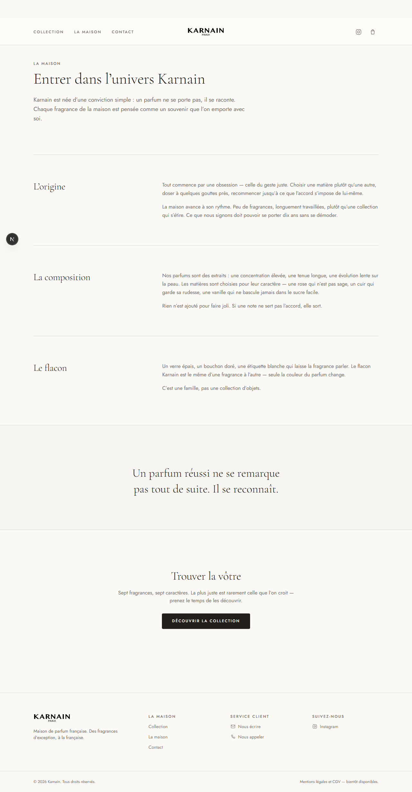
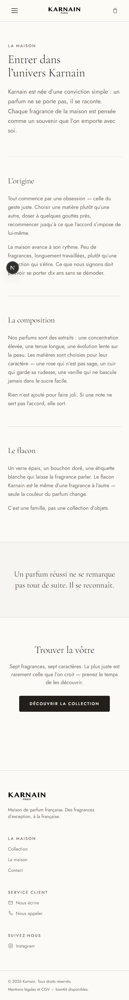

# Brand story page — `/maison`

**Feature:** brand story page · **Spec:** none (quick track, see note) · **Branch:** `feat/013-maison-brand-story`
**Date:** 2026-08-12 · **Author:** Achref Arabi (+ Claude Opus 5)

## What & why

Maroin asked for “une page en mettant l’histoire de la marque, pour faire rentrer les gens
dans l’univers de la marque”. The story previously existed only as a `#histoire` anchor
carrying two paragraphs on the homepage. This adds a dedicated `/maison` page — lede, three
chapters, a pull quote, and a CTA into the collection — with the homepage section demoted to
a teaser that links through.

The copy is **deliberate placeholder**: evocative, but asserting no sourceable history, so
nothing has to be retracted when the client sends his real story.

> **No spec.** This was taken on the quick track at the requester’s explicit direction
> (“we track and fast work”), so there is no `specs/013-*/` with acceptance criteria. The
> table below maps the client’s stated requirements to evidence instead. Flagged because the
> feature track would normally require a spec.

## Requirements → evidence

| Requirement (client’s words)                                                   | Proven by                                                         | Evidence                 | Verdict                                                            |
| ------------------------------------------------------------------------------ | ----------------------------------------------------------------- | ------------------------ | ------------------------------------------------------------------ |
| A dedicated page for the brand story                                           | `e2e/maison.spec.ts` — “visitor reaches the maison page”          | `img/maison-desktop.png` | ✅                                                                 |
| It should “faire rentrer les gens dans l’univers” — a real read, not two lines | Three chapters + pull quote render; page is 2 452 px tall         | `img/maison-desktop.png` | ✅                                                                 |
| Reachable from the site chrome                                                 | `e2e/maison.spec.ts` — “the header nav points at the maison page” | —                        | ✅                                                                 |
| Reachable from the homepage story section                                      | Same spec — clicks “Découvrir la maison” from `/`                 | —                        | ✅                                                                 |
| Leads onward into the collection                                               | Same spec — asserts `/collection` after the CTA                   | `img/maison-desktop.png` | ✅                                                                 |
| Works on mobile                                                                | `e2e/maison.spec.ts` at 390×844                                   | `img/maison-mobile.png`  | ✅                                                                 |
| Real brand story content                                                       | —                                                                 | —                        | ⛔ **Not met.** Placeholder copy; content pending from the client. |

## Screenshots

**Desktop** — `/maison`, 1280 px

**Mobile** — `/maison`, 390 px

Both were captured by `pnpm e2e` and inspected, not merely generated.

## Changes

| Layer   | Files                                                                                                             | Notes                                                                                                     |
| ------- | ----------------------------------------------------------------------------------------------------------------- | --------------------------------------------------------------------------------------------------------- |
| App     | `src/app/(site)/maison/page.tsx` (new)                                                                            | Server component; composition only. Prerenders static.                                                    |
| App     | `src/app/(site)/page.tsx`                                                                                         | Story section gains a “Découvrir la maison” link. `id="histoire"` kept so old anchor links still resolve. |
| Core    | `src/core/i18n/messages/fr.ts`                                                                                    | New `maison` block (flagged placeholder in a comment); `story.cta`; nav “La maison” → `/maison`.          |
| E2E     | `e2e/maison.spec.ts` (new)                                                                                        | Two CUJ-A cases.                                                                                          |
| Docs    | `critical-user-journeys.md`, `features/brand-foundation.md`, `INDEX.md`, `blender-product-imagery-brief.md` (new) | CUJ-A extended; feature doc records the placeholder-copy decision.                                        |
| Harness | `.gitattributes` (new)                                                                                            | Line-ending fix, below.                                                                                   |
| Assets  | `public/images/collection.png` (deleted)                                                                          | Orphaned, 2.1 MB.                                                                                         |

Notable decisions:

- **No new component.** The page composes existing `Container`, `Reveal`, `buttonVariants`.
  Nothing was added to `components/ui` for a single page.
- **Copy lives in `core/i18n`**, consistent with the rest of the site chrome, so the
  typography gate sees it and a future locale is additive.
- **Placeholder copy is marked in code**, not just in docs — a comment above `dict.maison`
  explains why it asserts nothing factual.

## Verification

| Gate                  | Result                                                                                 |
| --------------------- | -------------------------------------------------------------------------------------- |
| `pnpm verify`         | ✅ exit 0 — lint, typecheck, format, docs (78 files), typography, 15 unit tests, build |
| `pnpm e2e`            | ✅ 6/6 passing (CUJ-A ×3, CUJ-B, CUJ-C, not-found)                                     |
| Screenshots inspected | ✅ desktop + mobile                                                                    |
| Persona `/review`     | ⛔ not run                                                                             |

**Build gate repaired as part of this work.** `pnpm verify` could not pass on a Windows
clone: `core.autocrlf=true` checked the tree out as CRLF while Prettier expects LF, failing
`format:check` on all 229 files. Fixed by pinning `* text=auto eol=lf`. No gate was weakened.

One self-review defect was found and fixed before merge: the first version of
`e2e/maison.spec.ts` used `getByRole("navigation")`, which matched both the header and
footer navs (both render `dict.nav.items`) and failed on strict mode. Scoped to the
brand-labelled header nav.

## Follow-ups

- **Real brand story copy** from Maroin. His 27 July voice notes were transcribed at source
  and cover only photography — the story content has never been supplied.
- **Cormorant Garamond misplaces French diacritics.** Verified in Chrome against a
  controlled specimen: accents sit right of their base letter at 300 and 400 weight, at 18 px
  and 36 px, while the system serif renders correctly. **Pre-existing and sitewide** — it
  affects “Rose des Îles”, “Sucre Addictée” and “Chérie” too — but most visible in this
  page’s display copy. EB Garamond is the closest drop-in; swapping a brand typeface is a
  design decision, so it was left untouched.
- **Persona `/review` and a spec** were skipped by agreement; run them if this is promoted
  to the feature track.
- **Deploy**: the branch push produced no Vercel build. The project has only ever built
  `main` (last on 8 June) and its metadata references GitHub org `DigitariaWebs` while the
  remote is now `ProgixDev`. Check the Git integration before relying on merge-to-deploy.
