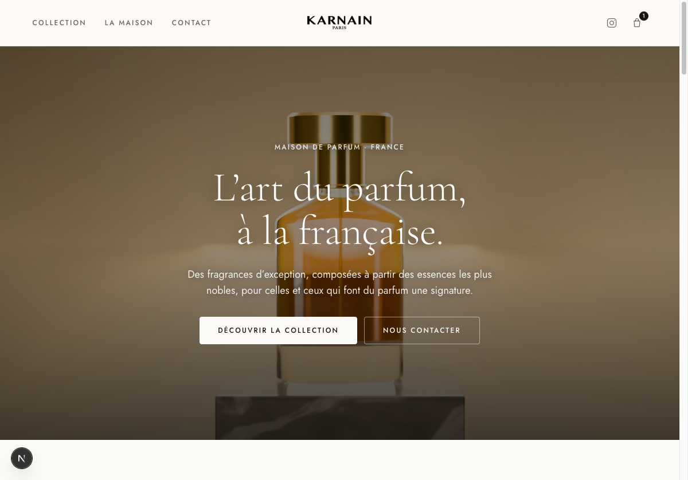
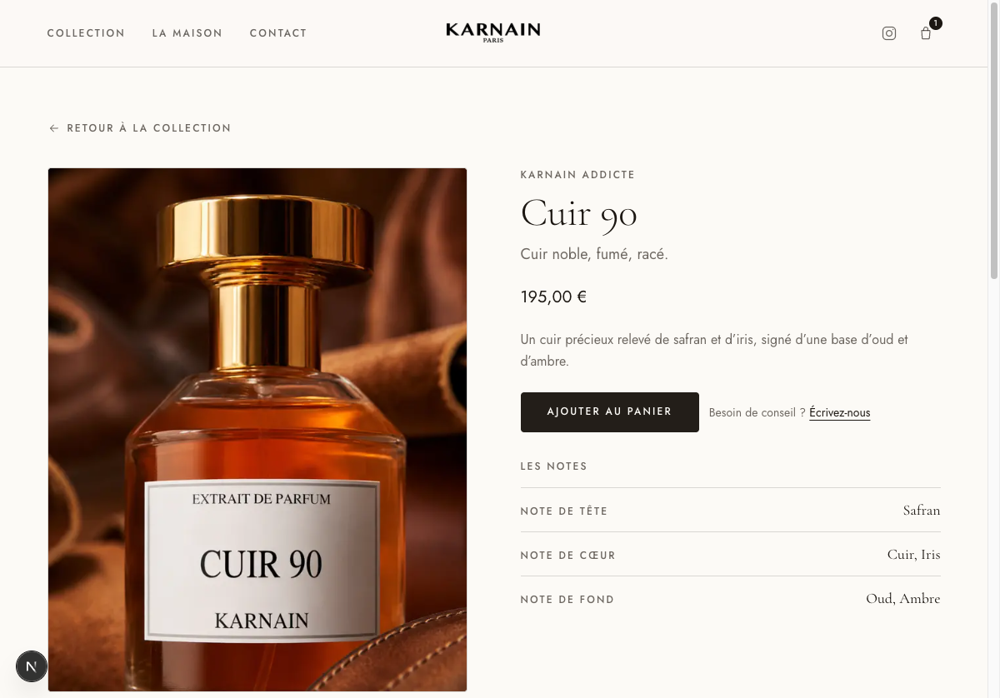
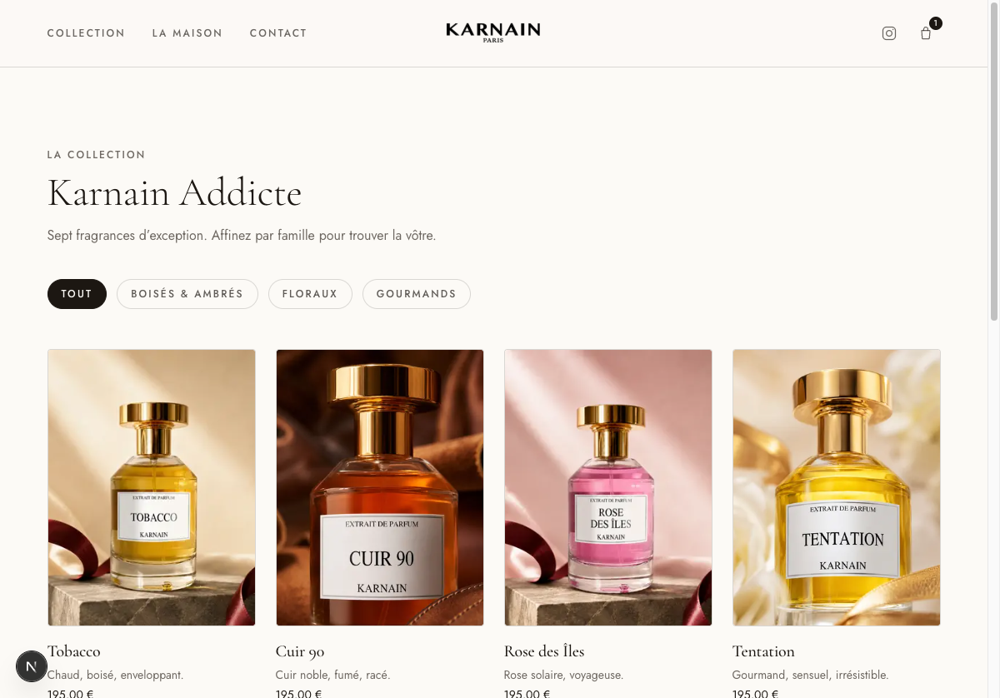

# Karnain — Launch report

**Date:** 2026-06-07 · **Owner:** progix · **Prepared for:** Karnain (Marouane)

A refined, French-language website for the Karnain perfume house: an editorial homepage with
a 3D video hero, product pages with a guest shopping bag, a filterable collection, an
Instagram-integrated brand story, and a Supabase-ready catalog with an admin back office.
Built on a spec-driven Next.js harness; every change is verified and screenshot-evidenced.

## What shipped

| Spec | Feature                        | Highlights                                                                     |
| ---- | ------------------------------ | ------------------------------------------------------------------------------ |
| 001  | Brand foundation & homepage    | Luxury design system (ivory/ink + serif), app shell, French i18n               |
| 002  | Shop — product page & bag      | Gallery + keyboard lightbox, scent notes, guest cart (drawer + `/panier`)      |
| 003  | Collection page                | All fragrances, scent-family filters via shareable URLs                        |
| 004  | Editorial campaign + Instagram | Full-bleed campaign band and a “Suivez-nous” lifestyle strip                   |
| 005  | Supabase data layer + admin    | Catalog from Supabase (seed fallback) + admin CRUD at `/admin` (Supabase Auth) |
| 007  | 3D video hero + contrast fix   | 360° bottle video background, scrim + text-shadow for legibility               |
| 008  | Brand logo                     | KARNAIN · PARIS wordmark in header, footer, and mobile menu                    |

Real product photography is wired for 5 of the 7 fragrances; Sucre Addictée and Rose des
Bois use intentional placeholders until photos exist.

## The experience

### Homepage — 3D video hero



### Product page — gallery, notes, add to bag



### Collection — scent-family filters



## Verification

- **`pnpm verify` green** — ESLint (+ module boundaries), TypeScript strict, Prettier, docs
  link integrity, copy/typography, unit tests, and a production build.
- **End-to-end (Playwright) green** — the critical user journeys:
  - **CUJ-A** Discover the house (homepage)
  - **CUJ-B** Explore a fragrance and fill the bag (product → drawer → cart)
  - **CUJ-C** Browse the collection (filter by family → open a fragrance)
- Screenshots captured per journey in `artifacts/screenshots/`.

## Architecture & decisions

- **Stack:** Next.js 16 (App Router, RSC), TypeScript strict, Tailwind v4 + shadcn/ui,
  Zustand (guest bag), Motion, Supabase (`@supabase/ssr`). Hosting: Vercel.
- **Layered module boundaries** (`app → features → shared → core`), ESLint-enforced; feature
  slices: `catalog`, `cart`, `admin`.
- **Commerce:** cart/bag (LV/JPG style). Online payment is deferred (Stripe) pending
  payment + legal.
- Decisions recorded as ADRs in `../architecture/decisions/` (e.g. ADR-0005, Supabase data
  layer with seed fallback).

## Data & admin

The catalog reads from **Supabase when configured, and an in-code seed otherwise** — so the
site runs with zero configuration today. To activate the managed catalog + admin: set
`NEXT_PUBLIC_SUPABASE_URL` and `NEXT_PUBLIC_SUPABASE_PUBLISHABLE_KEY`, run
`supabase/migrations/*_init_catalog.sql`, and create an admin user in the Supabase
dashboard. The admin lives at `/admin` (Supabase Auth, no public sign-up).

## Outstanding (needs client input)

- **Supabase** project URL + publishable key (then catalog + admin go live).
- **Real contact** — email + phone (placeholders today) and **legal/CGV** copy.
- **Payment** — decision + Stripe keys → enable checkout.
- **Photos** — Sucre Addictée + Rose des Bois (or drop them).

## Run & deploy

```bash
pnpm install
pnpm dev        # http://localhost:3000
pnpm verify     # full local gate
pnpm e2e        # critical user journeys
```

Deployed on Vercel (Next.js auto-detected). The build needs no environment variables —
it runs on the seed catalog until Supabase keys are added in the Vercel project settings.
